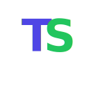
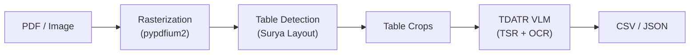
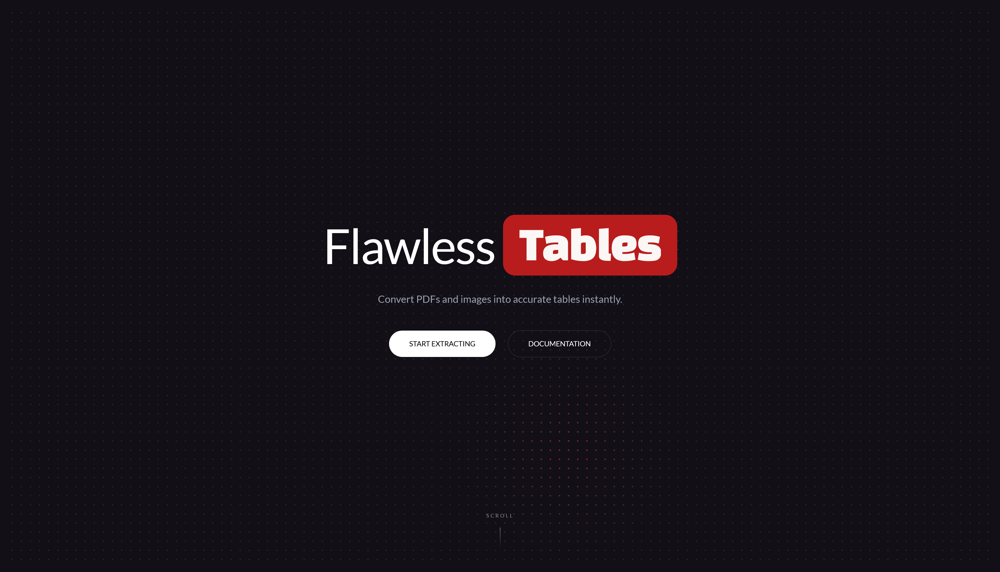

<p align="center">
  
</p>

# Tablesmith — STP 7.0 Table Extraction

> End-to-end table extraction from PDFs and images: detect tables, parse structure, export CSV/JSON.

<p align="center">
  <a href="https://table-extraction-front.onrender.com/"><strong>Try the live app →</strong></a>
</p>

[](https://www.python.org/downloads/release/python-3120/)
[](https://www.docker.com/)
[](https://modal.com/)
[](https://table-extraction-front.onrender.com/)

> 🏆 **STP 7.0 Machathon**
>
> 📊 **Table Extraction**
>
> 🥇 **1st place raw model score**
>
> 🥈 **2nd place overall**

## TL;DR

Upload a PDF or image and get structured tables back as CSV or Excel in seconds.
**[Try it live →](https://table-extraction-front.onrender.com/)**

|               |                                                                 |
|---------------|-----------------------------------------------------------------|
| Fast mode     | TATR pipeline — low latency, CPU-only possible                  |
| Accurate mode | Surya + TDATR VLM — full structure and OCR, GPU-backed          |
| Export        | CSV or Excel (.xlsx) per table                                  |
| AI assistant  | Ask Smithy questions about extracted tables in natural language |

## Project Overview

Built for the **STP 7.0 Machathon — Table Extraction** competition, a three-phase challenge that evaluated table
detection, structure recognition, and full end-to-end OCR accuracy. The pipeline progressively upgraded its models
across phases, culminating in a combination of **Surya Layout Detector** for bounding-box detection and **TDATR**
(CVPR 2026) for joint structure recognition and OCR. The team achieved **1st place in Phase 1** and
**1st place by raw model score**, placing **2nd overall** in the final competition ranking.

## Pipeline Architecture

### Final Phase Flow



### Model Progression

Each phase introduced a more capable stack. The final pipeline replaced every component.

**Phase 1** — Detection + structure only, no OCR

| Stage                 | Model                    |
|-----------------------|--------------------------|
| Table Detection       | Table Transformer (TATR) |
| Structure Recognition | Table Transformer / TATR |

**Phase 2** — Added OCR on top of the Phase 1 stack

| Stage                 | Model                    |
|-----------------------|--------------------------|
| Table Detection       | Table Transformer (TATR) |
| Structure Recognition | Table Transformer / TATR |
| OCR                   | PP-OCR                   |

**Final Phase** — Full pipeline replacement; end-to-end with a single VLM

| Stage                       | Model                 |
|-----------------------------|-----------------------|
| Table Detection             | Surya Layout Detector |
| Structure Recognition + OCR | TDATR VLM (CVPR 2026) |

### TDATR

[TDATR](https://arxiv.org/abs/2603.22819v1) is a CVPR 2026 end-to-end table recognition model built on a
"Perceive-then-Fuse" strategy. It unifies structure understanding and content recognition under a language modeling
paradigm, eliminating the need for a separate OCR stage. Key capabilities:

- **Table Detail-Aware Learning** — pretraining tasks spanning structure and content recognition
- **Structure-Guided Cell Localization** — refines cell boxes via structure priors and multi-level visual features
- **Zero-shot generalization** — evaluated on seven benchmarks without dataset-specific fine-tuning

The model is loaded as an in-process singleton on GPU and kept warm across requests, eliminating the ~30s
re-initialization cost of subprocess-based approaches.

## Phase Results

| Phase   | Metric          | Value     |
|---------|-----------------|-----------|
| Phase 1 | mAP@0.5         | 1.0000    |
| Phase 1 | mAP@0.5:0.95    | 0.9818    |
| Phase 2 | TD F1           | 0.9965    |
| Phase 2 | TSR F1          | 0.8989    |
| Phase 2 | Score           | 0.9185    |
| Final   | Table F1        | 0.890     |
| Final   | Cell F1         | 0.837     |
| Final   | GriTS           | 0.809     |
| Final   | TEDS            | 0.760     |
| Final   | **Final Score** | **0.792** |

> **GriTS** (Grid Table Similarity) measures structural correctness at the grid level.
> **TEDS** (Tree-Edit Distance based Similarity) measures similarity to the ground-truth HTML table structure.
> **mAP@0.5** and **mAP@0.5:0.95** are standard COCO detection metrics evaluated on table bounding boxes.

## Deployed Application

**Live:** [table-extraction-front.onrender.com](https://table-extraction-front.onrender.com/)



The production app is a full-stack deployment: a React frontend on Render, backed by a FastAPI service running on
Modal with GPU inference. It exposes all pipeline capabilities through a polished UI.

### Features

| Feature                 | Details                                                                                              |
|-------------------------|------------------------------------------------------------------------------------------------------|
| **Fast mode**           | Table Transformer / TATR pipeline (Phase 1 model) — lower latency, no GPU required                   |
| **Accurate mode**       | Surya + TDATR VLM pipeline (Final model) — full structure + OCR, GPU-backed                          |
| **Parallel processing** | Multiple files can be queued and processed concurrently                                              |
| **CSV export**          | Download any extracted table as a `.csv` file                                                        |
| **Excel export**        | Download results as a formatted `.xlsx` workbook                                                     |
| **Smithy AI assistant** | Gemini-powered chatbot embedded in the UI — ask questions about extracted tables in natural language |

### Infrastructure

The backend runs on Modal with two autoscaling classes:

| Class            | Hardware      | Role                                                                 |
|------------------|---------------|----------------------------------------------------------------------|
| `TableExtractor` | NVIDIA T4 GPU | Loads TDATR + Surya once; processes jobs one at a time per container |
| `WebApp`         | CPU           | Serves HTTP, handles uploads, dispatches jobs to `TableExtractor`    |

`WebApp` keeps one container always warm for instant upload responses. `TableExtractor` scales to zero when idle
and maintains a warm buffer of spare containers during active periods. Both classes use Modal's CPU memory snapshot
to eliminate library import overhead on cold starts — CUDA state and model weights are loaded post-snapshot so they
are re-initialized correctly on every restore.

## Getting Started

> To try the app without a local setup, use the [live deployment](https://table-extraction-front.onrender.com/).
> The steps below are for self-hosting the service.

### Prerequisites

- Docker and Docker Compose
- NVIDIA Container Toolkit (GPU passthrough)
- TDATR model checkpoint (`model.pt`) — download from [HuggingFace CCWM/TDATR](https://huggingface.co/CCWM/TDATR)
- Surya layout model directory and recognition model directory

### 1. Configure Environment

```bash
cp .env.example .env
```

Edit `.env` and set the required model paths:

```env
# Absolute host paths to model weights (mounted read-only into the container)
HOST_TDATR_CHECKPOINT=/absolute/path/to/model.pt
HOST_SURYA_LAYOUT_MODEL_DIR=/absolute/path/to/surya_layout
HOST_SURYA_RECOGNITION_MODEL_DIR=/absolute/path/to/surya_recognition

# Optional: Smithy chatbot (Gemini)
GEMINI_API_KEY=
```

Optional performance knobs (defaults shown):

```env
TABLE_DETECTION_THRESHOLD=0.0
TABLE_DETECTION_PADDING=5.0
TDATR_MAX_LEN=4096
TDATR_TEMPERATURE=0.5
JOB_WORKER_COUNT=2
GPU_CONCURRENCY=1
JOB_QUEUE_SIZE=0        # 0 = unbounded
MAX_FILE_SIZE_MB=100
```

### 2. Run with Docker

```bash
docker-compose up --build
```

The API starts at `http://localhost:8000`. Interactive docs are at `http://localhost:8000/docs`.

The container is based on `nvidia/cuda:12.8.1-base-ubuntu22.04` with Python 3.12. Model weights are mounted
read-only from the host; the `./storage` directory is bind-mounted for persisted job data and results.

## Limitations

| Limitation                 | Detail                                                                                                                                  |
|----------------------------|-----------------------------------------------------------------------------------------------------------------------------------------|
| Max file size              | 100 MB per upload                                                                                                                       |
| GPU cold start             | `TableExtractor` scales to zero when idle — the first request after inactivity incurs a ~30–60s model load delay on the live deployment |
| One GPU job per container  | Concurrent uploads are queued; throughput scales by adding more GPU containers, not by parallelizing within one                         |
| Accurate mode requires GPU | Self-hosting accurate mode requires an NVIDIA GPU with CUDA 12.8 and the nvidia-container-toolkit                                       |

## Team

**Tablesmith** — STP 7.0 Machathon, Table Extraction Track

- Yousif Abdulhafiz — [@ysif9](https://github.com/ysif9)
- Mohammed Metwally — [@MohammedAhmed124](https://github.com/MohammedAhmed124)
- Ahmed Lotfy — [@alofty25](https://github.com/alofty25)
- Philopater Guirgis — [@Philodoescode](https://github.com/Philodoescode)
- Soliman Elhassanein - [@SolimanElhassanein](https://github.com/Soliman-Elhassanein)
